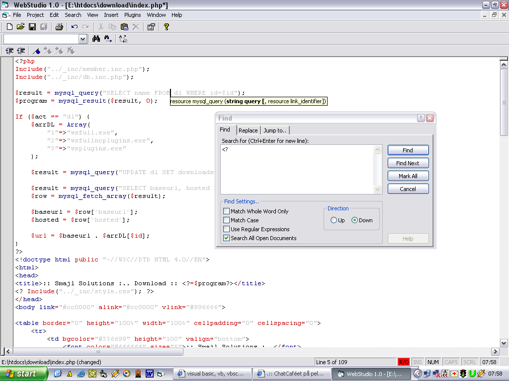

<div align="center">

## WebStudio \- Webeditor


</div>

### Description

Remember cEdit? Everyone just loved it, so if you loved cEdit.. You'll adore this ;o) WebStudio is an advanced kind of web-editor with support for:<br><br>

* Syntax highlightning, defined in syntax files<br>

* Microsoft Visual Basic like CodeTips and CodeList (Using CodeSense)<br>

* MDI interface<br>

* Welcome Screen - Helps you to start with the program fast..<br>

* File Templates<br>

* Bookmarks (*Note* Does not work properly under NT systems)<br>

* Plugins - Code found on PSC<br>

* Powerful Find/Replace/Jump - As soon as I write it anyway ;oP<br>

* Nice Open/Save dialogs - Using code from former vbWeb/vbAccelerator (Developers Fusion)<br>

* Project-manager is planned<br>

* More..<br><br>

This editor was inspired by all the good editors out there, UltraEdit, cEdit, EditPlus, Developers Pad, etc, etc.. Some code have been found on PSC (Sorry if I can't give you the proper credits..)<br><br>

This is not a cEdit ripoff or something, I've been working on this editor for a long time.. started -99 to be exact.. Never finished it thou.. Propably never will..<br><br>

So, why am I posting this on PSC then?<br>

Easy, sharing!! And I also want to get some help with new ideas, better code, improvements and so on.. So if you find anything that you can do better and wants to share it with me, mail me at henrik@ih.nu and we'll discuss it..

<br><br>

Ehh, yeah, vote if you think it's worth it..<br><br>

// Henrik Malmberg aka H3nk3<br><br>

*Note*<br>

I'm using CodeSense in this project (Thanks Barry & Nathan), get it here:<br>

http://www.ticz.com/~nlewis/index.html?target=download<br><br>

Also using SSubTmr6.dll from vbAccelerator (Thanks Steve), get it here:<br>

http://www.vbaccelerator.com/<br>

*End Note*
 
### More Info
 


<span>             |<span>
---                |---
**Submitted On**   |
**By**             |[Henrik Malmberg](https://github.com/Planet-Source-Code/PSCIndex/blob/master/ByAuthor/henrik-malmberg.md)
**Level**          |Intermediate
**User Rating**    |3.4 (27 globes from 8 users)
**Compatibility**  |VB 6\.0
**Category**       |[Complete Applications](https://github.com/Planet-Source-Code/PSCIndex/blob/master/ByCategory/complete-applications__1-27.md)
**World**          |[Visual Basic](https://github.com/Planet-Source-Code/PSCIndex/blob/master/ByWorld/visual-basic.md)
**Archive File**   |[](https://github.com/Planet-Source-Code/henrik-malmberg-webstudio-webeditor__1-30811/archive/master.zip)


### Source Code

```
Took too long time to upload, got Scripte.TimeOut, download from here instead:
http://yoda.ih.nu/p/ws.zip
```

